<div align="center">

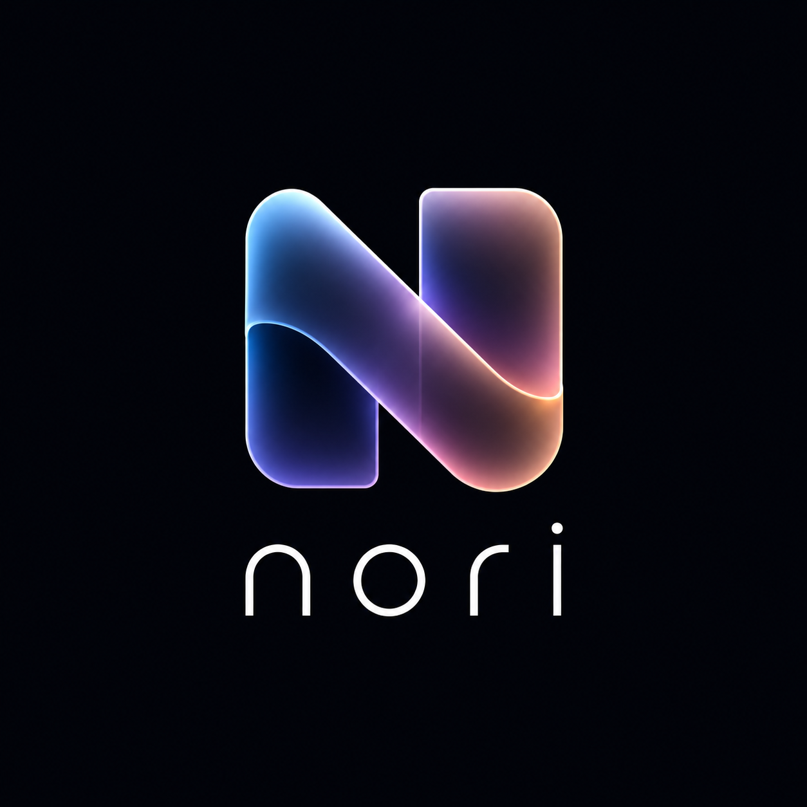

# Nori

**An infinite, real-time spatial workspace for thinking together.**

Drop cards, sketch ideas, group them in frames, connect them with lines, comment in threads — all on a glassmorphic infinite canvas, synced live across every collaborator.

[](https://nextjs.org)
[](https://react.dev)
[](https://www.typescriptlang.org)
[](https://www.mongodb.com/atlas)
[](https://yjs.dev)
[](https://tailwindcss.com)

<br/>

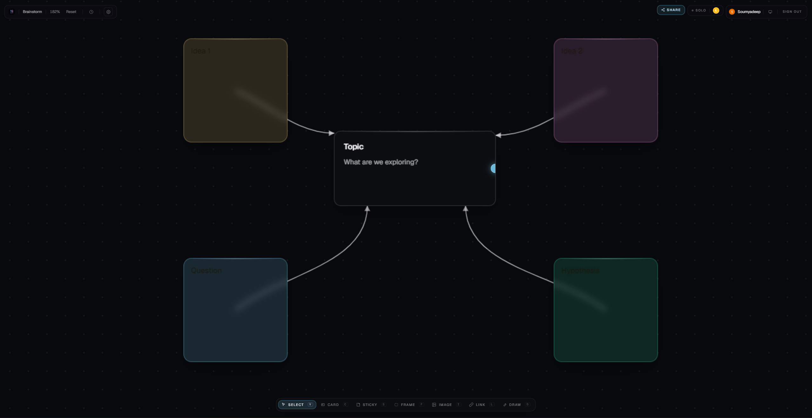

</div>

---

## What is Nori?

Nori is a **collaborative spatial workspace** — think the open-canvas energy of Figma's FigJam or Miro, but stripped down to a fast, opinionated core and rebuilt around a real-time CRDT so every move, edit, and cursor is shared instantly.

You start with an infinite dark canvas. Drop a card, paste an image, jot a sticky, sketch with the pen tool, group things in a dashed frame, draw an arrow between two nodes. Share the URL — your collaborators land on the same canvas with their own cursor, their own colour, and their own undo history.

It's built to **stay out of your way**. No sidebars full of tools you'll never use, no modal dialogs for everyday actions. Just the canvas, a floating tool palette, and keyboard shortcuts for everything.

<br/>

<div align="center">
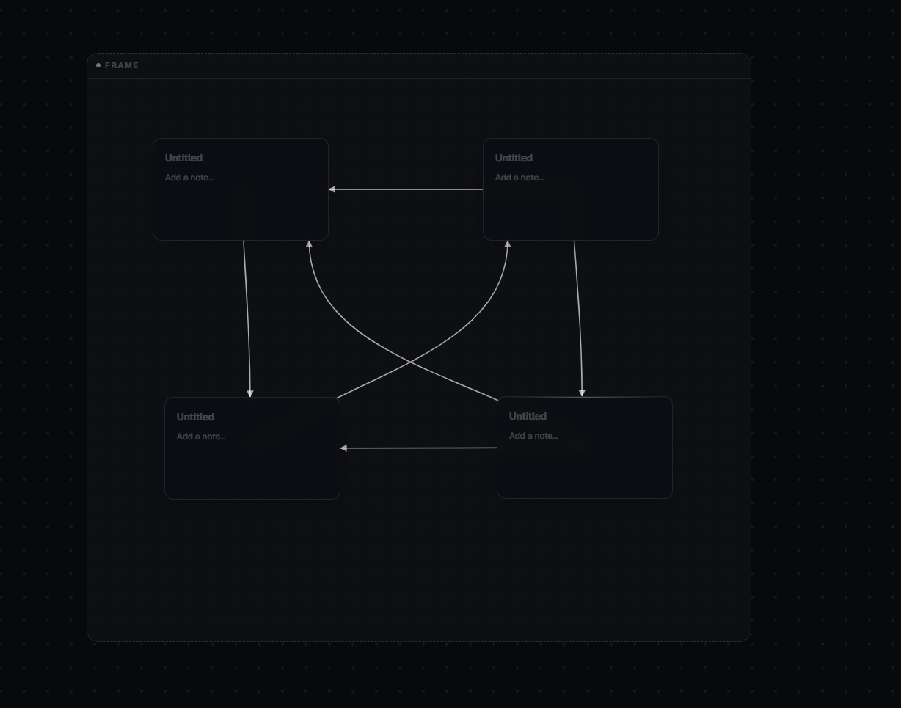
<br/>
<sub><i>A frame grouping ideas, with arrows showing the flow between them.</i></sub>
</div>

---

## ✨ Features

### 🎨 Canvas primitives

| | |
|---|---|
| **Cards** | Title + body. Your everyday note. |
| **Stickies** | Coloured short notes — yellow, pink, blue, green, amber. |
| **Frames** | Translucent dashed regions that group nodes. Drag the frame, everything inside moves with it. |
| **Images** | Drop a file, paste from clipboard, or upload. |
| **Links** | Paste a URL, get an Open Graph preview automatically. |
| **Drawings** | Freehand pen tool — smoothed strokes captured as nodes. |
| **Connections** | Drag from the hover-dot on one card's edge to another to draw a curved arrow. |
| **Threads** | Comment any node. Resolve when done. Threaded conversations attached to canvas content. |

### 🌐 Real-time collaboration
- **Live cursors** with per-user colours and names — see exactly where your collaborators are looking.
- **Conflict-free edits** via Yjs CRDTs over a Hocuspocus WebSocket — two people editing the same card never collide.
- **Per-user undo / redo** — `Cmd/Ctrl+Z` reverses *your* edits, not someone else's.
- **Presence pills** in the top bar showing who's currently in the workspace.
- **Share links** with two scopes — *edit invite* and *view-only* — each backed by a regenerable token.

### 🧭 Get around faster
- **Infinite canvas** — pan with drag, zoom with scroll, pinch-to-zoom on touch devices, two-finger pan.
- **Command palette** (`Cmd/Ctrl+K`) — fuzzy-search every action.
- **Keyboard shortcuts** for every tool (V/C/S/F/I/L/D) and operation (press `?` for the full list).
- **Box-select** with shift-drag, multi-select with shift-click.
- **Templates** — start blank, or seed with a *Brainstorm* / *Roadmap* layout.

### 📋 Workspace lifecycle
- **Workspaces** — create, rename, share, delete. Stored in MongoDB Atlas.
- **Activity feed** — per-workspace timeline of "X created a card", "Y edited Z", "A commented on B" for async catch-up.
- **Export** — capture the canvas as a PNG via the right-click menu.
- **Read-only mode** — viewers see a faint amber top strip, suppressed hover affordances, and a `View only` badge.
- **Per-workspace onboarding** — a contextual tutorial on first visit, with template-aware tips for brainstorm and roadmap.

### 📱 Touch & mobile
- Pinch-to-zoom and two-finger pan via multi-pointer tracking.
- Tap targets bumped to ≥44px on coarse pointers.
- Tool palette collapses to icon-only on narrow viewports.

---

## 🖼️ A closer look

<table>
<tr>
<td width="50%" align="center">
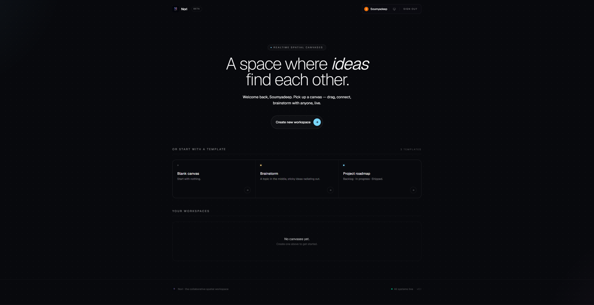
<br/>
<sub><b>Dashboard</b> — pick a template, jump into a recent workspace, or start blank.</sub>
</td>
<td width="50%" align="center">
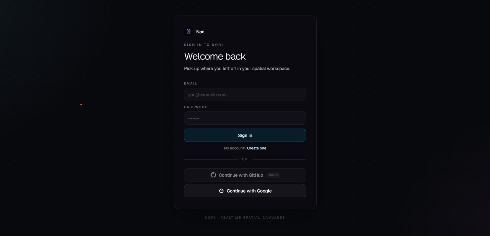
<br/>
<sub><b>Sign in</b> — email/password, Google, or GitHub (coming).</sub>
</td>
</tr>
<tr>
<td width="50%" align="center">
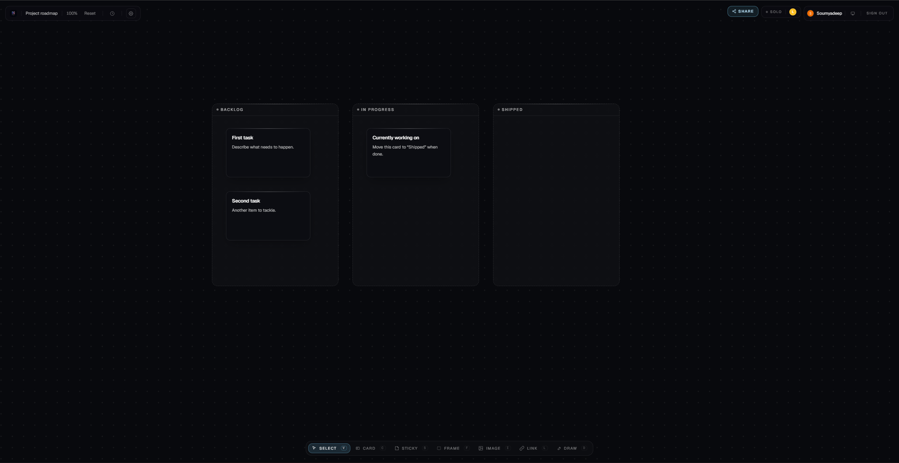
<br/>
<sub><b>Roadmap template</b> — Backlog · In progress · Shipped, ready to fill in.</sub>
</td>
<td width="50%" align="center">
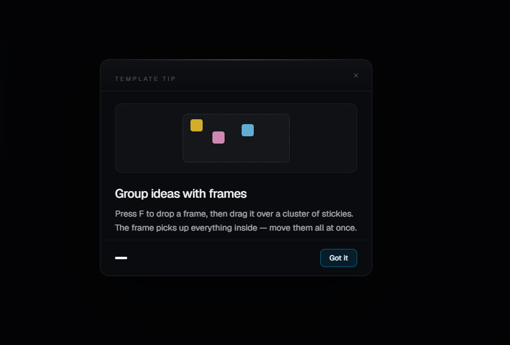
<br/>
<sub><b>Contextual tips</b> — template-aware nudges on first visit.</sub>
</td>
</tr>
<tr>
<td width="50%" align="center">
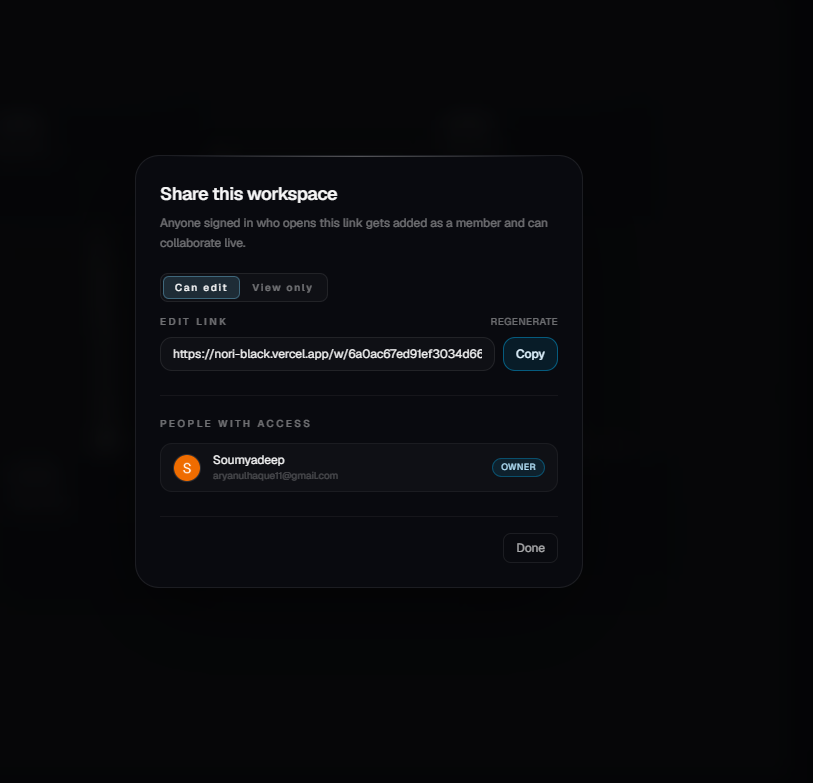
<br/>
<sub><b>Share</b> — edit-invite or view-only links, each with a regenerable token.</sub>
</td>
<td width="50%" align="center">
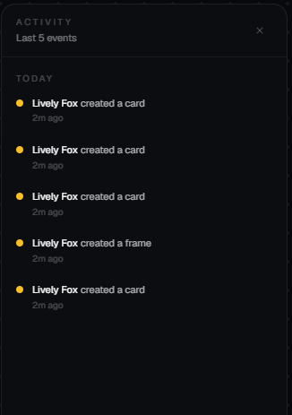
<br/>
<sub><b>Activity feed</b> — async catch-up on what changed and who did it.</sub>
</td>
</tr>
<tr>
<td width="50%" align="center">
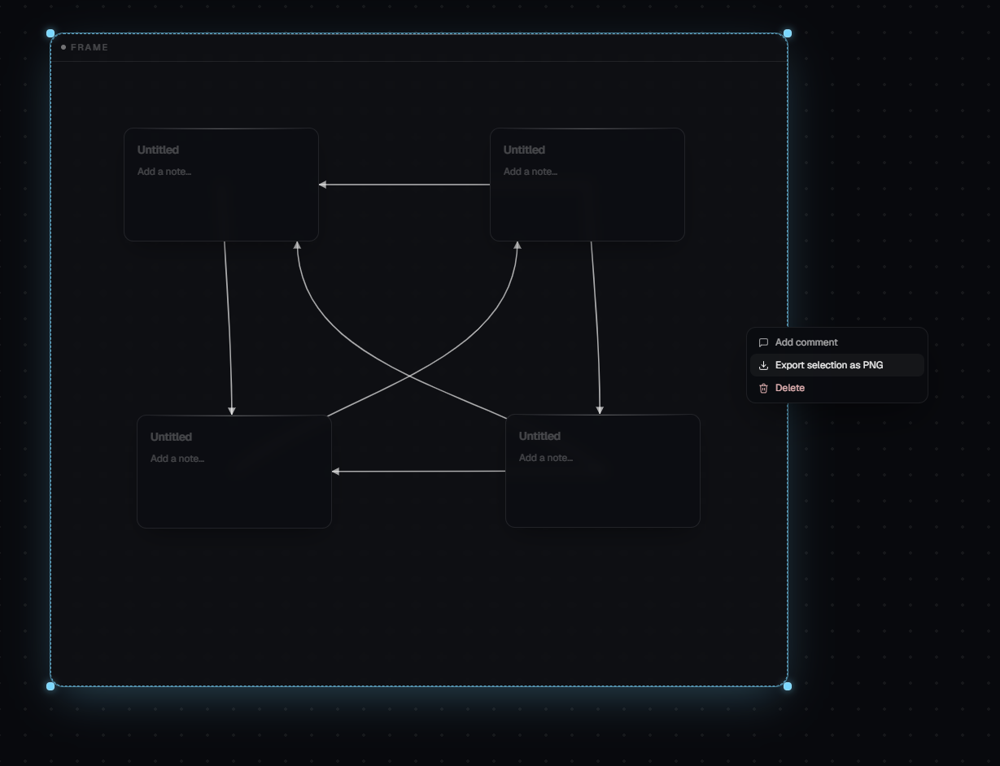
<br/>
<sub><b>Right-click menu</b> — comment, export selection as PNG, delete.</sub>
</td>
<td width="50%" align="center">
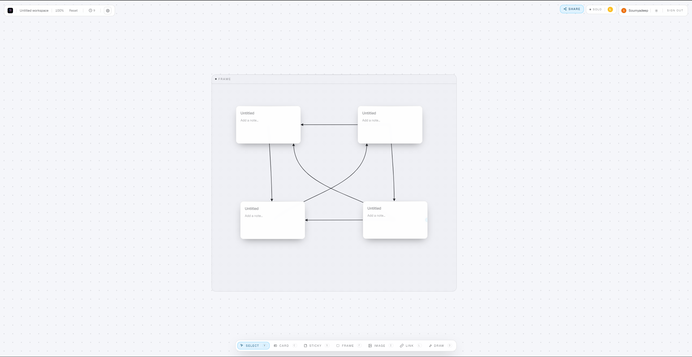
<br/>
<sub><b>Light theme</b> — the same canvas, in daylight.</sub>
</td>
</tr>
</table>

---

## ⌨️ Keyboard shortcuts

| Shortcut | Action |
|---|---|
| `V` | Select tool |
| `C` | Card |
| `S` | Sticky |
| `F` | Frame |
| `I` | Image |
| `L` | Link |
| `D` | Draw (pen) |
| `Shift + drag` | Box-select |
| `Shift + click` | Add to selection |
| `M` | Open thread on selected node |
| `Cmd/Ctrl + K` | Command palette |
| `Cmd/Ctrl + Z` | Undo |
| `Cmd/Ctrl + Shift + Z` | Redo |
| `Cmd/Ctrl + A` | Select all nodes |
| `Delete` / `Backspace` | Delete selection |
| `?` | Shortcuts overlay |
| `Esc` | Close overlay / clear selection |

---

## 🏗️ Architecture

```
┌────────────────────┐    HTTPS / Server Actions    ┌──────────────────┐
│  Next.js 16 (App)  │ ──────────────────────────▶  │  MongoDB Atlas   │
│  React 19 + Zustand│ ◀──────────────────────────  │  (auth, snapshots)
└────────┬───────────┘                              └────────┬─────────┘
         │                                                   ▲
         │ Yjs updates                                       │ debounced
         │ over WSS                                          │ persistence
         ▼                                                   │
┌────────────────────┐                              ┌────────┴─────────┐
│   Hocuspocus       │ ─────────────────────────▶   │  Node/Conn/Thread│
│   sync server      │                              │  Activity models │
└────────────────────┘                              └──────────────────┘
```

| Layer | Tech |
|---|---|
| **Frontend** | Next.js 16 (App Router), React 19, TypeScript 5, Tailwind v4, Framer Motion |
| **State** | Zustand store, Yjs for shared state, custom realtime hook bridging the two |
| **Realtime** | Hocuspocus server + provider over WebSocket, awareness for cursors |
| **Data** | MongoDB Atlas via Mongoose, with `nori` database |
| **Auth** | NextAuth v5 — Google OAuth, GitHub OAuth, email/password (bcrypt) |
| **3D ambient** | React Three Fiber for the home-page background only — the canvas itself is plain 2D |

---

## 🚀 Quick start

### 1. Prerequisites
- **Node 20+** and **npm**
- A **MongoDB** connection string (local or [Atlas](https://www.mongodb.com/atlas))
- (Optional) **Google / GitHub OAuth credentials** for social login

### 2. Install

```bash
git clone https://github.com/<your-org>/nori.git
cd nori
npm install
```

### 3. Configure environment

Copy the template and fill in your secrets:

```bash
cp .env.example .env.local  # or just edit the existing .env.local
```

Required vars in `.env.local`:

```ini
# MongoDB
MONGODB_URI=mongodb+srv://<user>:<pass>@<cluster>/?appName=Nori

# Realtime
HOCUSPOCUS_PORT=1234
NEXT_PUBLIC_HOCUSPOCUS_URL=ws://localhost:1234

# Auth (generate with: npx auth secret)
AUTH_SECRET=<32+ random bytes>

# Optional — Google OAuth
AUTH_GOOGLE_ID=
AUTH_GOOGLE_SECRET=

# Optional — GitHub OAuth
AUTH_GITHUB_ID=
AUTH_GITHUB_SECRET=
```

### 4. Run both servers

You need **two processes** running in parallel — the Next.js app and the Hocuspocus realtime server.

```bash
# Terminal 1 — Next.js
npm run dev

# Terminal 2 — Hocuspocus
npm run hocuspocus
```

Open [http://localhost:3000](http://localhost:3000) and sign in.

> **Heads-up:** if you change a Mongoose schema, restart **both** servers — hot-reload caches the old model and silently drops new fields.

---

## 🌍 Deploy

| Service | Used for | Notes |
|---|---|---|
| **Vercel** | Next.js app | Standard Next.js deploy. Set all `AUTH_*` + `MONGODB_URI` + `NEXT_PUBLIC_HOCUSPOCUS_URL` env vars. |
| **Render** | Hocuspocus server | Web Service running `npm run hocuspocus`. Use the `wss://` URL from Render as `NEXT_PUBLIC_HOCUSPOCUS_URL`. |
| **MongoDB Atlas** | Database | Allow Vercel + Render egress IPs (or `0.0.0.0/0` for the free tier). |

For Google OAuth, add to **Authorized redirect URIs** in Google Cloud Console:
```
https://<your-vercel-domain>/api/auth/callback/google
```
and set `AUTH_TRUST_HOST=true` on Vercel.

---

## 🛠️ Utility scripts

```bash
npx tsx scripts/wipe-db.ts    # drop every collection in the nori database
                              # (requires typing "wipe nori" to confirm)
```

---

## 📁 Project layout

```
nori/
├── server/
│   └── hocuspocus.ts        # WebSocket realtime server (separate process)
├── src/
│   ├── app/                 # Next.js App Router pages + API routes
│   ├── components/
│   │   ├── canvas/          # InfiniteCanvas, NodeCard, ToolPalette, …
│   │   ├── workspace/       # Shell, hotkeys, tutorial, share modal
│   │   └── ui/              # Toolbar, presence bar, toasts
│   ├── hooks/               # use-realtime, use-workspace-hotkeys, …
│   ├── lib/
│   │   ├── actions/         # Server actions (workspace CRUD)
│   │   ├── models/          # Mongoose schemas
│   │   ├── realtime/        # Yjs provider, identity, JWT tokens
│   │   └── templates.ts     # Blank / Brainstorm / Roadmap seeds
│   ├── store/
│   │   └── canvas-store.ts  # Zustand store — single source of truth
│   └── types/
│       └── canvas.ts        # Shared canvas types
└── scripts/
    └── wipe-db.ts
```

---

## 🤝 Contributing

PRs welcome. A couple of conventions baked into the codebase that are worth knowing before you start:

- **Modals & popovers must portal to `document.body`** — `WorkspaceShell` has a `pointer-events-none` overlay that swallows clicks inside it.
- **The world-transform wrapper is `pointer-events-none`** — children opt back in with `pointer-events-auto`.
- **Mongoose schema changes need a full dev + hocuspocus restart** — hot-reload caches the old model.
- **Tests, lint, typecheck** before pushing — `npx tsc --noEmit` and `npm run lint`.

---

<div align="center">

Built with care.

<sub><i>Pan. Drop. Connect. Think out loud — together.</i></sub>

</div>
